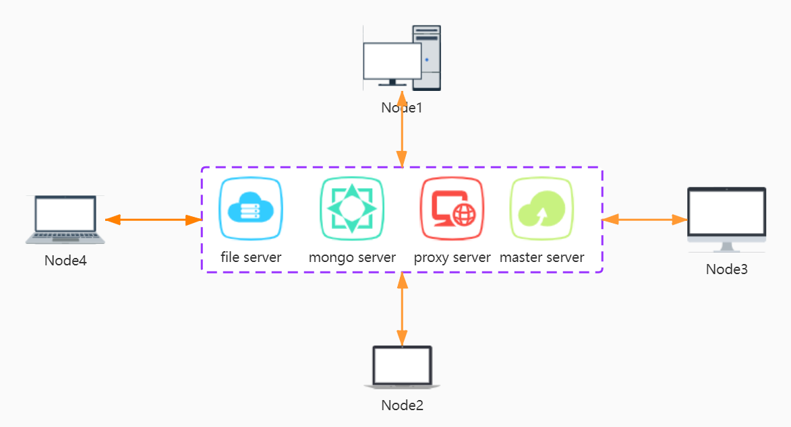
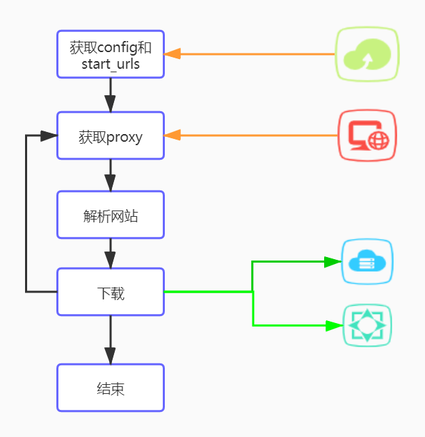

# crawler-low-levelmasterdocrawler

## 项目介绍

总项目为实现一个学术网站综合搜索引擎，用户可以检索到一篇论文的综合信息，不仅有pdf文件，还有oral视频，数据集，源代码等多模态信息。本项目为总项目下的爬虫模块，实现对crossmind、acl、paper with code、arxiv和paperweekly的爬取，实现了爬取学术论文相关的元信息、pdf文件、讲解视频和数据集等信息。

## 目录

[toc]

## 小组分工

| 姓名                                    | 学号       | 分工                           |
| --------------------------------------- | ---------- | ------------------------------ |
| [雷云霖](https://github.com/Lylist)     | 3120201035 | 系统架构搭建，scrapy健壮性优化 |
| [魏博](https://github.com/Web985)       | 3120201080 | 数据库，scrapy速度优化         |
| [李家伟](https://github.com/Captainr22) | 3120201036 | crossmind网站爬取              |
| [马放](https://github.com/BD-MF)        |3120201055  | acl网站爬取                    |
| [宦紫仪](https://github.com/hsnowsunny) |3220200891  | paperwithcode网站爬取          |
| [蔡建](https://github.com/MrdotCai)     | 3120201001 | arxiv网站爬取，IP池开发        |
| [吴为伦](https://github.com/PoolSon)    |3120201082  | paperweekly网站爬取            |

## 功能特色

#### 1、支持分布式爬取

- 充分利用每个人的设备，一定程度上平摊成本，增加系统的性能及可扩展性

#### 2、支持增量式爬取

- 聚合多个网站上爬取结果，可设置定时任务定时启动爬取，持续搜集

#### 3、IP池爬取

- 部署了一个爬虫服务爬取免费可用的代理IP，向proxy服务发送请求即可获得一个随机可用的IP，增加爬虫的健壮性

#### 4、线程池爬取

- 多线程爬取数据，快人一步

#### 5、使用简单，全平台支持

- 支持Windows、Linux和MacOS平台运行，各组件积木式使用，修改配置文件后运行脚本即可快速使用

## 系统架构

#### 1、系统总体



本系统为分布式的，在远程端部署文件存储服务、数据库服务、IP池proxy服务和master节点。本地节点可以从master节点获取任务，之后爬取，将爬取的数据再传输到远程相关服务中。

这些服务都是可解耦合的，增加系统的稳定性。但资源与成本有限，这四个服务部署在一个服务器上了。

#### 2、爬虫服务



本地爬虫先获取配置文件，这个可以本地修改也可以部署服务从master节点自动获取，然后通过中间件获取IP池服务提供的proxy，用这个proxy去请求网站，获得回复后解析页面，提取相关信息。然后送入下载组件，下载PDF、视频等数据。下载完成后上传到文件服务和数据库服务。然后处理下一个页面，直到所有任务完成。

## 执行方法及原理

### 一、 执行方法

#### 1、运行环境

系统：Windows、Linux、MacOS

软件：python3

#### 2、安装依赖

```
pip install -r requirements.txt
```

#### 3、运行

- 将仓库克隆至本地

- 修改`config.yaml`和`start_urls.txt`(如果需要)

- Windows系统执行`start.bat`文件，Linux、MacOS执行`start.sh`即可快速运行

### 二、各模块执行原理

#### 1、Crossmind

实现了快速爬取crossmind网站，可以在十个小时左右爬取完所有的数据。

##### 1.1\. 整体流程

Crossminds视频爬取流程主要分为两步：第一，在网页把所有视频的url信息爬取下来保存到本地。第二、通过不同方式访问不同类型的url进行视频爬取。

##### 1.2\. 论文信息爬取
Crossminds视频页是动态加载页面，我们分析了三种处理动态加载页面的方式：直接通过构造requests请求访问数据、通过selenium爬取数据以及通过splash爬取数据。由于直接通过requests访问数据的爬取速度比其他两种方式快得多，所以采用这种方式来爬取。具体过程如下：

   - 找到浏览器向服务器请求数据的url：https://api.crossminds.io/web/content/bycategory
   - 分析请求数据的url，浏览器像服务器发送的是POST请求，请求参数为Request Payload(json)格式。
   - 分析请求参数的规律：请求参数中**limit**表示每次返回的视频个数；**offset**为偏移量，初始值为0，**category**表示当前正在爬取什么会议的信息。
   - 分析返回数据：返回数据中，有用的信息包括**results**和**next_request**。其中，**results**中包含我们第一步需要的论文的所有信息。**next_rquest**为下一次浏览器要发送的请求参数，也就是说我们只需要找到浏览器的初始请求参数，不需要为POST请求的参数再找规律。
   - 使用代码模拟浏览器向数据库发送请求，动态构造请求参数得到所有数据。(先通过前一个页面得到目前所有会议的名称信息，请求参数中初始化的**offset**为0，接下来的请求参数从**next_request**中获取，当返回数据为**null**时，将**category**设置成下一个会议，直至所有数据爬取结束)。
   - 将数据以csv格式保存到本地。

##### 1.3\. 视频爬取
Crossminds中的视频包含三种格式：youtube_video,m3u8_video和Vimeo_video(3100条数据中仅有一条)。我们主要对前两种格式的video视频进行爬取。
1. youtube_video使用第三方工具pytube对youtube视频进行下载。

2. m3u8_video视频爬取：
   * 首先通过url解析m3u8文件，得到一个视频信息的文本文件。
   * 分析文本文件是否经过加密（Crossminds中的m3u8视频均未加密）
   * 通过视频文本文件中的url下载ts视频文件，这个ts文件为整个视频的子文件，每个ts视频为整个视频文件中的某几秒信息。
   * 合并所有ts视频为一个完整的m3u8视频文件。

3. 构造线程池快速下载视频
由于视频文件下载速度过慢，所以我们希望通过多线程的方式在同一时间一次性下载多个视频，提高视频的爬取速度。
我们在爬取视频文件的过程中，通过threadpool构造线程池，同时下载一个会议中的所有视频信息（例如CVPR2020中共有1645条视频，那么会同时启动1645个线程，使这1645条视频同时下载）。事实上，考虑到网络带宽的限制以及同时大量访问会使得ip地址被封的问题，在实际操作中我们使用没10秒启动一个线程，大大增加了视频的爬取速度。最终爬取3100条视频用时不超过12小时。

4. 构造ip池下载视频
虽然每10秒启动一个线程，对线程池进行了一定的限制，但这种快速访问仍然会造成封ip的现象，所以我们使用了ip代理池，访问每一个视频url的ip都是不同的，不会造成ip被封的问题。

##### 1.4\. pdf以及code的爬取
通过**正则表达式**解析**description**内容可以得到**300条**左右的pdf和code信息。然而由于视频数量远远大于pdf和code的数量，所以我们主要的pdf来源于小组其他成员爬取的**arxiv**和**paperwithcode**中的数据。我们以paper的title作为标识符对论文及pdf和code进行匹配，最终能为**1686**条视频匹配到其对应的pdf和code。

##### 1.5\. 具体运行
爬取Crossminds论文信息
```
python crawl_data.py
```
多线程下载视频:
```
python download_video.py
```
上传到mongoDB中，并于arxiv和paperwithcode中的数据匹配:
```
python rename.py
python dataManager.py
```


#### 2、ACL Anthology

   基于Scrapy框架开发,高效率爬取https://www.aclweb.org/anthology/ 网站上的论文，包括论文基本信息及论文pdf文件、视频文件，支持增量式爬取，使用了代理和ip池等技术。

   ##### 2.1\. 整体流程
   经过调查分析，ACL Anthology有两种遍历方法：根据首页面table爬取或者网站提供的bib压缩包，这里考虑到ACL页面为静态页面，其基本信息均在静态页面上，无需对其做更多特殊处理，所以这里选择前者——根据页面table进行遍历爬取.
   ACL Anthology 论文爬取一共分为两个流程。首先进去ACL主页https://www.aclweb.org/anthology/， 可也看到ACL主页有一个表格，其记录ACL具体年份、具体会议的链接地址，然后进入具体会议具体年份中，每年的ACL具体会议有不同的Contents,进入不同Contents对论文列表遍历爬取。进入一篇论文的主页后，分别用xmpath爬取论文的具体基本信息。 
   第二个流程是爬取论文的pdf、video等文件，对于ACL中的大部分论文都有pdf链接，少部分没有pdf链接。对于论文pdf，有的文章会有附件，根据url下载即可（判断是否存在，防止重复下载），需要注意的是同一类附件可能有多个。对于ACL的Video文件，其主要有三类：youtube、vimeo和slideslive。近两年的视频主要在slideslive上，先前的大部分视频在vimeo上。需要注意的是需要找出每篇论文的video文件地址，对于slideslive需要先找出其vimeo_id，然后根据vimeo_id进行视频下载（这里首先下载到本地，然后再上传至服务器）。最后将爬取到的论文相关信息及pdf、video文件上传至服务器mongodb和文件夹中。相关中间件为```ACLPaperPdfFilePipeline```、```ACLPaperVideoFilePipeline```、```MongoDbPipeline```


   ##### 2.2\. video 爬取
   ACL 论文的视频主要在slideslive.com和vimeo.com两个网站，经过分析， 2020年的论文视频全在slideslive.com这个网站上，2020之前论文视频全在vimeo.com 这个网站上
      

#### 3、arxiv
- 选择使用Scrapy框架爬取arxiv.org

- 依据规律的URL格式定制爬虫，增量式爬取

  访问arxiv站点可构造适当的URL，按月获取当月的所有论文简要信息，如：https://arxiv.org/list/cs/2001?skip=0&show=1000
  表示获取2020年1月从第一个记录开始的1000条论文记录。

  运行爬虫之前，可以自由定制多个URL存于start_urls.txt文件中，作为本次爬取的目标。

  每条论文记录中有该论文的具体展示页面的URL，解析这个URL可以获取论文的标题、作者、摘要等信息生成item反馈给pipeline。

- 每一个item会依次经过三个pipeline——```ArxivPDFFetcherPipeline```、```ArxivJsonWriterPipeline```、```MongoDbPipeline```。它们分别起：获取PDF论文原文并解析原文内容、以json格式纪录每一条item信息以及上传到中心结点的作用。

- 过分频繁的请求会被arxiv网站检测，导致一定时间的IP封禁。所以新增了scrapy的下载中间件：ArxivDownloaderMiddleware。此中间件的任务就是针对每一条请求，首先请求中心服务器的IP池服务获取可用的代理IP，再根据情况选择是否更换代理。由于代理质量的问题，目前完全使用代理的爬取速度不太理想。注意到arxiv网站针对爬虫的IP封禁基于请求频度，故现采用本地IP与代理IP间歇更换的策略，这样既能保证一定程度的爬取速度，同时也能降低本地IP对站点的访问频率。一定比例的本地IP和代理IP使用时间间隙可以让爬虫与arxiv服务器和谐共存，由```ArxivDownloaderMiddleware```中间件控制。目前的设定代理IP时隙与本地IP时隙比例为3:1，经测试，属arxiv服务器可接受范围。

#### 4、Paper with code

Papers with Code 是一个总结了机器学习论文及其代码实现的网站。它提供了很多论文都是有GitHub代码的。它对机器学习做了任务分类，可以根据类别检索相关的文章。它创建了一个免费开放的机器学习论文、代码和评估表资源。

Papers with Code把所有文章按照他们完成的任务分成不同的类别，像网页（https://www.paperswithcode.com/sota）中展示的这样。

网站把每个大的类别划分为很多小的子任务。

在爬取时，爬虫遍历访问每个类别，然后依次遍历每个类别中的子任务，在子任务中获取所有对应的文章。

在子任务展示页面中，会包含每篇论文详细页面的URL，以及对应的github代码链接。

因此，爬虫解析每篇文章详细信息页面的URL，爬取对应文章的年份、标题、摘要、作者以及代码链接等信息。./crawler/spiders/papersWithCode_crawler.py文件中是具体的实现代码。

#### 5、paperweekly

Paperweekly网站是一个是论文推荐网站，每日会给用户推荐当日更新的十篇arXiv的论文。

##### 5.1\. 整体流程
首先通过获取推荐页面上的论文的arXiv编号，通过该编号访问arXiv网站该论文的页面，进而在arXiv爬取该论文的作者、标题、摘要等信息.

##### 5.2\. 论文编号爬取
Paperweekly的推荐论文页面是用JavaScript渲染的动态加载页面，通过分析Network中的浏览器和数据库的交互信息，发现一条能够直接获取页面HTML信息的url(https://zijin.paperweekly.site/api/v1/arxiv_paper/) ，若直接访问该url会显示502拒绝，需要加上Authorization信息后才可成功访问。

##### 5.3\. 论文信息爬取
通过获取的论文编号拼接上arXiv网站的前缀，获得了论文页面的url，通过常规的arXiv爬取方式，去获得论文的标题、作者、摘要等信息，最终保存到数据库中，具体代码实现在./crawler/spiders/paperweekly_crawler.py文件中。

#### 6、IP池服务
对于arxiv和crossmind有反爬机制，若访问过于频繁会出现IP被封锁的情况，研究决定使用代理IP的方式，对于每次的爬取，可在download时视情况设定是否使用或者更换代理IP。

代理IP池现具备以下功能：

- IP池部署在中心服务结点上，其它从结点机器可以通过http请求的方式获取json格式的代理IP信息。
- 中心服务结点将爬取到的免费代理存于Redis数据库中。
- ProxySpider多线程地爬取各大代理网站的免费代理，并将可使用的代理IP存放于数据库中，构成IP池。
- 周期性地验证IP池中的代理IP是否有效，定时更新IP池状态。
- 可更换、增加免费代理源。


##### Requirements

APScheduler==3.2.0
werkzeug==0.15.3
Flask==1.0
requests==2.20.0
lxml==4.3.1
PyExecJS==1.5.1
click==7.0
gunicorn==19.9.0
redis


##### Redis数据库搭建

Redis 是完全开源的，遵守 BSD 协议，是一个高性能的 key-value 数据库。

- 下载及编译

```shell
wget http://download.redis.io/releases/redis-6.0.8.tar.gz
tar xzf redis-6.0.8.tar.gz
cd redis-6.0.8
make
```

- 修改配置文件```redis.conf```789行密码

- 启动redis服务

```shell
cd src
./redis-server ../redis.conf
```

- 检查redis是否启动

```shell
redis-cli
```


##### IP池配置步骤

- 获取代码

- 安装依赖

  ```python
  pip install -r requirements.txt
  ```

- 更新setting.py配置文件

  ```python
  # 配置API服务
  HOST = "0.0.0.0"               # IP
  PORT = 5010                    # 监听端口
  
  # 配置数据库
  DB_CONN = 'redis://:pwd@127.0.0.1:6379/0'
  
  # 配置 ProxyFetcher
  PROXY_FETCHER = [
      "freeProxy01",      # 这里是启用的代理抓取方法名，所有fetch方法位于				                    # fetcher/proxyFetcher.py
      "freeProxy02",
      # ....
  ]
  ```

- 启动IP池服务

  ```python
  # 启动调度程序
  python proxyPool.py schedule
  # 启动webAPI服务
  python proxyPool.py server
  ```


##### 调度细节

- Python定时任务框架APScheduler定时进行代理IP的爬取和可用性检验。

- 调度设置

  ```python
  executors = {
          'default': {'type': 'threadpool', 'max_workers': 20},
          'processpool': ProcessPoolExecutor(max_workers=5)
      }
      '''
      默认使用线程调度任务，max_workers：最大线程/进程数量
      '''
  job_defaults = {
          'coalesce': False,
          'max_instances': 10
      }
      """
      max_instances: 每个job在同一时刻能够运行的最大实例数,默认情况下为1个,可以指定为     更大值,这样即使上个job还没运行完同一个job又被调度的话也能够再开一个线程执行
      coalesce:当由于某种原因导致某个job积攒了好几次没有实际运行（比如说系统挂了5分钟后     恢复，有一个任务是每分钟跑一次的，按道理说这5分钟内本来是“计划”运行5次的，但实际没有     执行），如果coalesce为True，下次这个job被submit给executor时，只会执行1次，也就     是最后这次，如果为False，那么会执行5次。
      """
  ```

- 每四分钟运行一次runProxyFetcher进行免费代理IP的爬取。

- 每两分钟运行一次runProxyCheck进行代理IP的可行性检验，对于IP池内的存在的所有代理IP，发送一次模拟代理HEADER请求，若任务超时，则判定失败，代理IP暂时不可用。

  ```python
  # --- proxy validator ---
  VERIFY_URL = "http://www.baidu.com" # 检验使用的URL
  VERIFY_TIMEOUT = 10
  MAX_FAIL_COUNT = 0
  ```


##### webAPI使用

- API接口

启动web服务后, 默认配置下会开启相关api接口服务:

| api         | method | Description      | arg           |
| ----------- | ------ | ---------------- | ------------- |
| /           | GET    | api介绍          | None          |
| /get        | GET    | 随机获取一个代理 | None          |
| /get_all    | GET    | 获取所有代理     | None          |
| /get_status | GET    | 查看代理数量     | None          |
| /delete     | GET    | 删除代理         | proxy=host:ip |

- /get获取的json格式

```python
{
    "check_count":879, # 此代理IP被检验的次数
    "fail_count":0, # 检验失败次数
    "last_status":1, # 上一次检验状态，1-成功
    "last_time":"2021-01-16 15:46:19", # 上一次检验时间
    "proxy":"183.232.231.133:80", # 代理IP
    "region":"",
    "source":"",
    "type":""
}
```


##### 代理源

目前实现的采集免费代理网站有：

- 无忧代理
- 66代理
- 西刺代理
- 全网代理
- 快代理
- 代理盒子
- 云代理
- IP海
- 免费代理库
- 89代理
- 西拉代理


#### 7、数据库

MongoDB是一个基于分布式文件系统的开源数据库系统，数据存储为一个文档，数据结构由键值对组成。文档类似于json对象，字段值可以包含其他文档，数据及文档数组。

##### 7.1\. 整体流程
对爬取的每一篇论文的信息进行标准化，在数据库查重之后增量式写入，如果没有新增信息则不进行操作。

##### 7.2\. 查重操作
因爬取范围涉及多个网站，且不同网站可爬取到论文的相关信息不完全相等（代码、视频等），在写入数据库之前进行查重操作。去除论文标题中的特殊符号，**只保留英文字母部分**，并全部**转为小写**，将该字符串作为唯一标识符_id。因去除了特殊字符，故仅当两个文档的_id完全相同时才将其视为同一论文的信息。当_id不同时，直接将该文档写入数据库，否则以新文档的字段为主，在数据库_id相同的文档的字段中逐一匹配，仅更新数据库中该文档字段为空的部分。

##### 7.3\. 具体运行
采用第三方工具pymongo与数据库进行交互。

连接数据库：
```
MongoManager(host, post)
```
选择数据库:
```
MongoManager.select_db(db_name)
```
选择集合：
```
MongoManager.select_col(col_name)
```
写入文档(包含根据key字段查重，默认为_id)：
```
MongoManager.push_one(item,key)
```

##### 7.4\.数据字段定义 
```
{ 
   "_id": "id", //唯一标识符 ,题目只保留英文字母部分，并转为小写
   "arxiv_id: "arxiv_id", //arxiv编码
   "doi": "doi", //论文唯一标识
   "title": "text", //文章标题 
   "authors": [ //列表类型，每个作者包括 firstName 字段和 lastName 字段 
      { 
         "firstName": "text", 
         "lastName": "text" 
      },
      { 
         "firstName": "text", 
         "lastName": "text" 
      } 
   ],
   "year": "2020", //出版年份
   "publisher": "acl", //发表期刊或会议
   "keywords": [ //论文关键词
      "keyword", 
      "keyword" 
     ],
   "abstract": "text", //摘要
   "subjects": "text", //论文分类 
   "paperUrl": "url", //论文在网上的url 
   "paperPath": "path", //论文在服务器上的路径
   "paperPdfUrl": "url", //论文pdf下载url
   "paperContent": { //论文pdf解析后的内容，检索组提供
      "text": "textall", 
      "subtitles":[ 
         "subtitle1", 
         "subtitle2", 
         "..." 
      ],
      "subtexts": [ 
         "subtext1", 
         "subtext2", 
         "..." 
      ] 
   },
   "references": [ 
      { 
         "refTitle": "text", 
         "refAuthors": [ 
            { 
               "refFirstName": "text", 
               "refLastName": "text" 
            },
            { 
               "refFirstName": "text", 
               "refLastName": "text" 
            } 
         ],
         "refYear": "year", 
         "refPublisher": "journal" 
      },
      { 
         "...": "..." 
      } 
   ],
   "videoUrl": "url", //视频在网上的url 
   "videoPath": "path", //视频存在服务器上的路径
   "videoFileUrl": "url", //视频下载Url
   "videoContent":{ //视频抽取结果，检索组提供
      "StartTime": [ 
         "time1", 
         "time2", 
         "..." 
      ],
      "EndTime": [ 
         "time1", 
         "time2", 
         "..." 
      ],
      "videoText": [ 
         "text1", 
         "text2", 
         "..." 
      ] 
   },
   "codeUrl": "url", //代码url 
   "datasetUrl": "url" //数据集url
}
```

## 整体效果

pass

## 代码及文件结构

- #### 代码结构

  ```
  .
  ├── conf
  │   ├── config.yaml  //运行配置文件
  │   └── logging_config.yaml //log配置文件(无需修改)
  ├── crawler
  │   ├── __init__.py
  │   ├── dataManager.py //数据库与服务器交互组件
  │   ├── items.py //爬取信息定义
  │   ├── middlewares.py //IP池中间件
  │   ├── pdfToJson //抽取PDF内容组件，检索组提供
  │   │   ├── __init_.py
  │   │   ├── client.py
  │   │   ├── config.json
  │   │   ├── pdfClient.py
  │   │   ├── requirements.txt
  │   │   ├── run.py
  │   │   └── xmlToJson.py
  │   ├── pipelines.py //各网站下载组件
  │   ├── settings.py
  │   └── spiders
  │       ├── __init__.py
  │       ├── acl_crawler.py //acl解析
  │       ├── arxiv_crawler.py //arxiv解析
  │       ├── papersWithCode_crawler.py //paperwithcode解析
  │       └── paperweekly_crawler.py //paperweekly解析
  ├── crossminds
  │   ├── crawl_data.py
  │   ├── dataManager.py
  │   ├── download_m3u8_video.py
  │   ├── download_video.py
  │   ├── download_youtube_video.py
  │   ├── log.py
  │   └── rename.py
  ├── download //下载本地存储文件夹
  ├── logs //log日志存储文件夹
  ├── output.json //爬取结果本地备份文件
  ├── run_crawler.py //执行主体
  ├── scrapy.cfg
  ├── start.bat //windows运行脚本
  ├── start.sh //Unix运行脚本
  └── start_urls.txt //爬取的站点
  ```

- #### 文件结构

  ```
  .
  ├── crossmind //crossmind下载视频存储
  ├── video //acl下载视频存储
  └── paper //所有pdf存储
  ```

  

## 特别鸣谢

感谢马放的两个移动硬盘以及他逝去的VPN。感谢学校网络中心这个月给我们每个人赠送的80G流量，没有让我们本就不富裕的家庭雪上加霜><!
